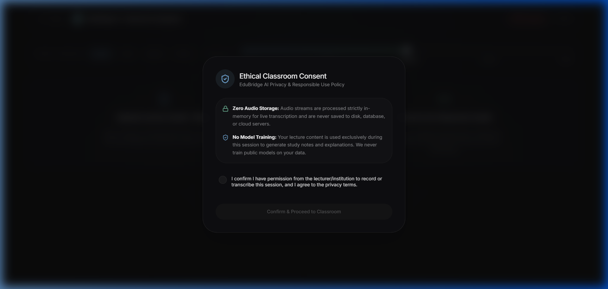
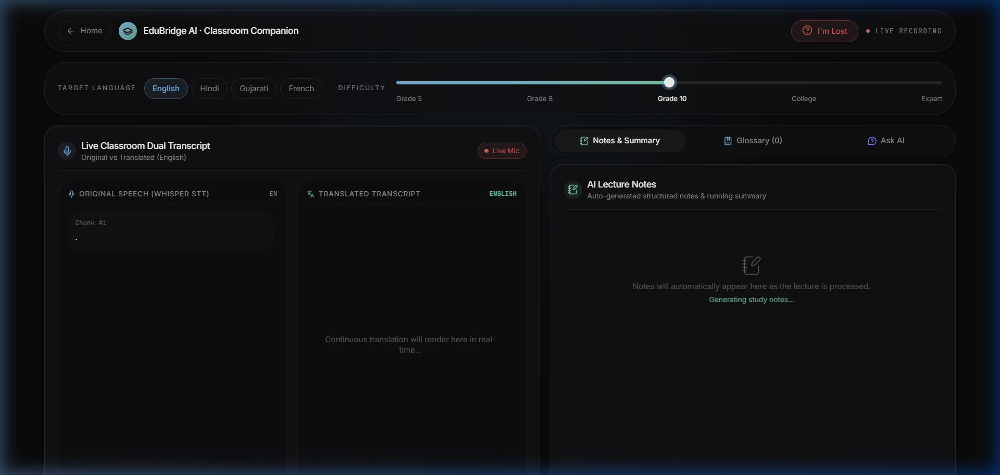
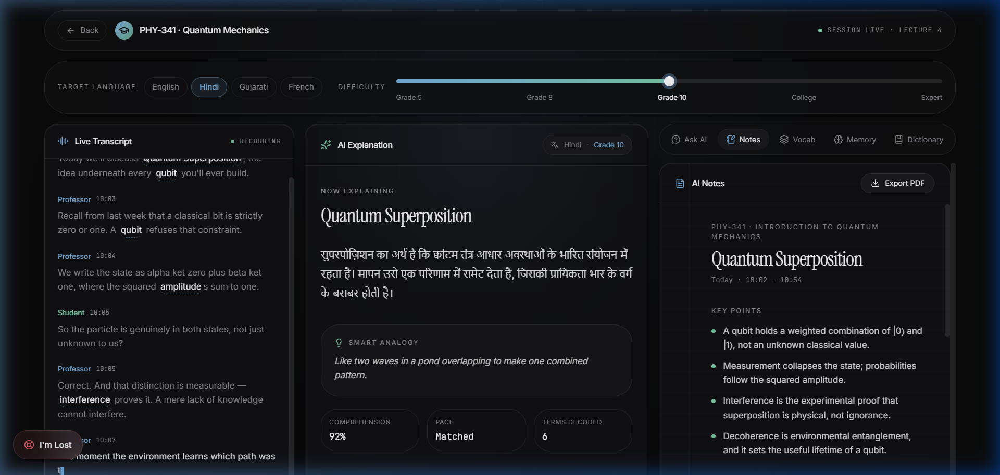
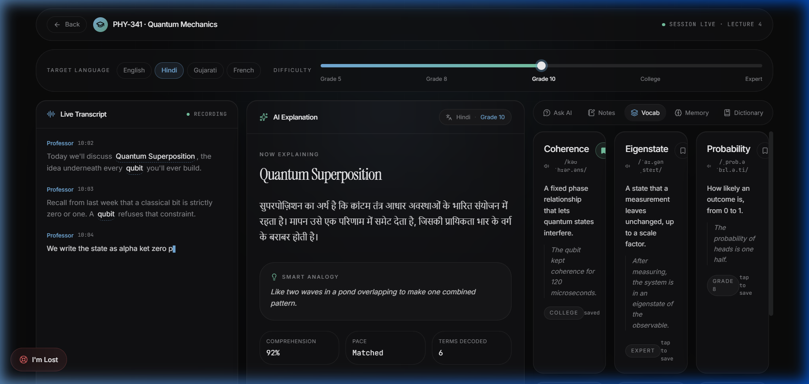
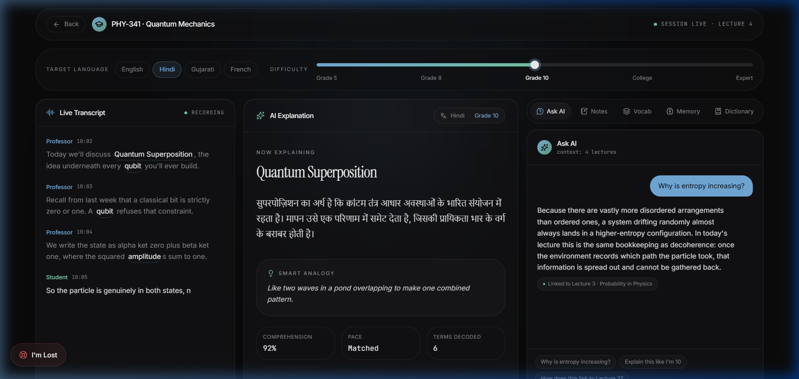
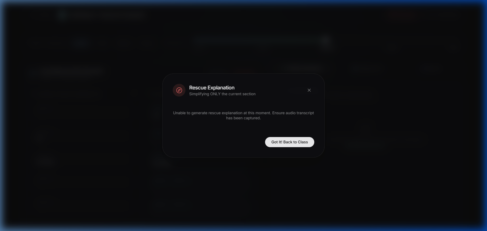
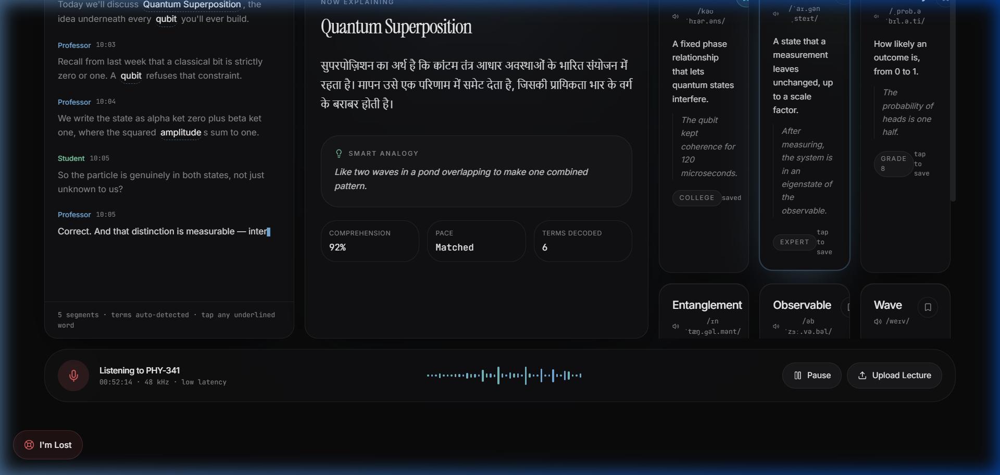
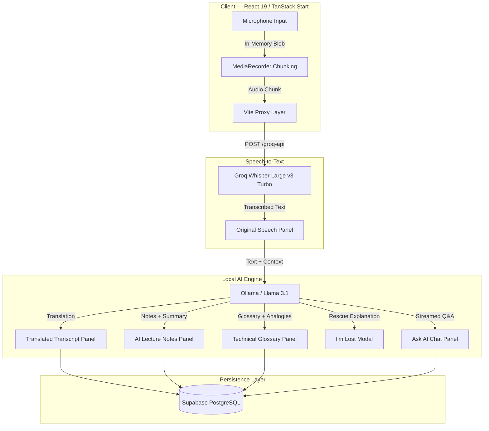
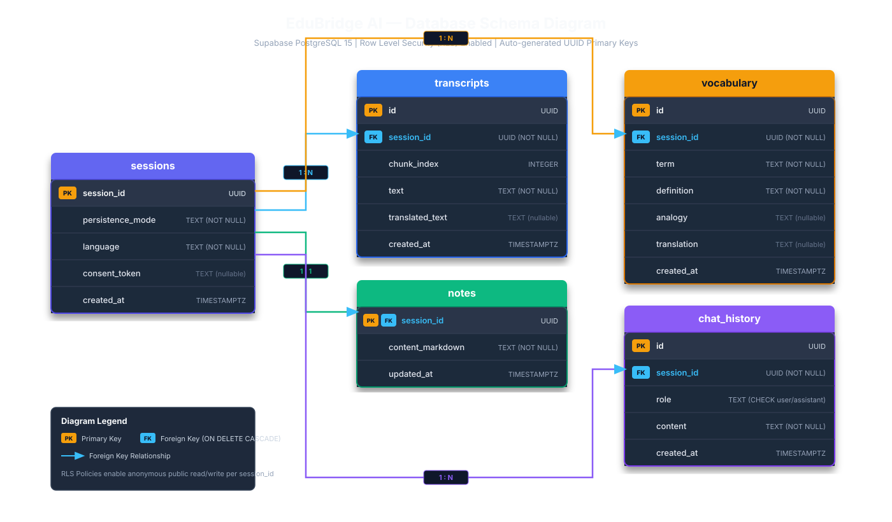
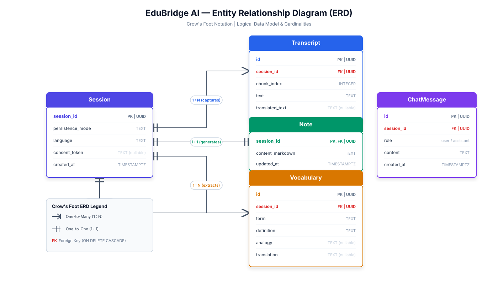

# EduBridge AI

### AI-Powered Real-Time Classroom Companion

[](https://react.dev/)
[](https://tanstack.com/)
[](https://www.typescriptlang.org/)
[](https://tailwindcss.com/)
[](https://supabase.com/)
[](https://ollama.com/)
[](https://groq.com/)

---

## Overview

EduBridge AI is an anonymous, privacy-first, real-time AI classroom companion designed to bridge comprehension gaps for students during lectures. It captures spoken lecture audio in-memory, provides live side-by-side bilingual translation, auto-generates structured lecture notes, extracts technical glossaries, provides an instant "I'm Lost" step-down rescue modal, and offers streamed Q&A grounded in live lecture context.

All AI inferencing is powered by a **local Llama 3.1 model** running through Ollama, with speech recognition handled by **Groq Whisper Large v3 Turbo**. No raw audio is ever stored — processing happens entirely in-memory and is discarded immediately after transcription.

---

## Table of Contents

- [Overview](#overview)
- [Interface Screenshots](#interface-screenshots)
  - [Landing Page](#landing-page)
  - [Ethical Consent Dialog](#ethical-consent-dialog)
  - [Classroom Dashboard](#classroom-dashboard)
  - [Live Recording Session](#live-recording-session)
  - [AI Notes and Summary Panel](#ai-notes-and-summary-panel)
  - [Technical Glossary Panel](#technical-glossary-panel)
  - [Ask AI Chat Panel](#ask-ai-chat-panel)
  - [I'm Lost Rescue Modal](#im-lost-rescue-modal)
  - [Demo Classroom Preview](#demo-classroom-preview)
- [Core Features](#core-features)
- [System Architecture](#system-architecture)
- [Data Flow Pipeline](#data-flow-pipeline)
- [Technology Stack](#technology-stack)
- [Database Schema](#database-schema)
- [Installation and Setup](#installation-and-setup)
- [Environment Configuration](#environment-configuration)
- [Security and Privacy](#security-and-privacy)
- [Project Structure](#project-structure)
- [License](#license)

---

## Interface Screenshots

### Landing Page

The landing page introduces the platform with a dark glassmorphic interface. It presents the product value proposition, outlines the six-step process from confusion to clarity, and showcases all platform capabilities.


*Figure 1: Hero section — "Understand every lecture. In your own language. At your own level."*


*Figure 2: Six-step process flow — from microphone input through STT, translation, note generation, to structured comprehension.*


*Figure 3: Capabilities grid — live transcription, multilingual translation, vocabulary extraction, difficulty calibration, and more.*


*Figure 4: Footer section with final call-to-action and technology credits.*

---

### Ethical Consent Dialog

Before any audio recording begins, the application presents an ethical consent dialog. Students must acknowledge the privacy policy and consent to in-memory audio processing before proceeding. No recording starts until consent is confirmed.


*Figure 5: Ethical consent dialog — privacy-first design requiring explicit student acknowledgment before any audio capture.*

---

### Classroom Dashboard

The classroom dashboard is the primary entry point for live sessions. Students select their target translation language (English, Hindi, Gujarati, French), set a difficulty level using the calibration slider (Grade 5 through Expert), and choose between live microphone recording or file upload.


*Figure 6: Classroom dashboard — language selector, difficulty calibration slider, and input mode selection cards.*

---

### Live Recording Session

During an active recording session, the interface displays a side-by-side dual transcript: the original speech (transcribed via Groq Whisper STT) on the left, and the translated transcript (processed via local Llama 3.1) on the right. A recording control bar at the bottom provides pause, resume, and stop controls with an elapsed time indicator.


*Figure 7: Live recording session — dual transcript display with original speech and translated output, alongside the tabbed study companion.*

---

### AI Notes and Summary Panel

The Notes and Summary panel displays auto-generated structured lecture notes extracted from each transcript chunk. Notes accumulate continuously throughout the session. A running summary is maintained and updated with each new chunk of audio processed.


*Figure 8: Notes and Summary panel — AI-generated structured notes with key concepts, explanations, and continuously updated lecture summary.*

---

### Technical Glossary Panel

The Glossary panel automatically identifies complex technical terms from the lecture transcript and generates formal definitions alongside simplified real-world analogies. Each term includes a pronunciation guide and contextual explanation appropriate to the selected difficulty level.


*Figure 9: Technical Glossary panel — extracted vocabulary with formal definitions and simplified analogies for each term.*

---

### Ask AI Chat Panel

The Ask AI panel provides an interactive Q&A interface where students can ask questions about the current lecture. Responses are streamed in real time and strictly grounded in the active lecture context — including the running summary, recent transcript chunks, notes, glossary terms, and keywords.


*Figure 10: Ask AI panel — lecture-grounded interactive Q&A with streamed responses from the local Llama 3.1 model.*

---

### I'm Lost Rescue Modal

When a student feels overwhelmed during a lecture, the "I'm Lost" button triggers a viewport-centered modal. The modal retrieves the last five transcript chunks and sends them to the local Llama 3.1 model, which generates a step-down explanation using simpler language and real-life analogies.


*Figure 11: "I'm Lost" rescue modal — viewport-centered overlay with simplified explanation generated from recent lecture context.*

---

### Demo Classroom Preview

The platform includes a fully interactive demo classroom on the landing page, showcasing pre-populated transcript data, AI-generated notes, vocabulary terms, and the Ask AI chat interface without requiring microphone access or API configuration.


*Figure 12: Demo classroom preview — interactive demonstration of the full platform experience with sample lecture data.*

---

## Core Features

| Feature | Description |
|---|---|
| Live Dual-Transcript | Streams spoken classroom audio from the browser microphone and displays original and translated text side-by-side in real time. |
| Real-time Multilingual Translation | Translates lecture speech into Hindi (Devanagari script), French, Gujarati, and English using the local Llama 3.1 model. |
| Auto-Generated AI Notes | Extracts structured markdown bullet-point notes, key takeaways, and running lecture summaries as the teacher speaks. |
| Contextual Technical Glossary | Identifies complex technical terms and creates formal definitions with real-world analogies at the selected difficulty level. |
| "I'm Lost" Step-Down Rescue | Simplifies the recent lecture segment with real-life analogies for overwhelmed students via a single-click rescue modal. |
| Lecture-Grounded Ask AI Chat | Streamed interactive Q&A where responses are strictly constrained to the active lecture context, notes, glossary, and keywords. |
| Privacy-First Architecture | Zero raw audio stored. Audio is processed in-memory and immediately garbage-collected. No PII collection or forced login. |
| Hybrid Local AI | Connects natively to a local Ollama instance running Llama 3.1 for zero-cost, offline AI inferencing. |

---

## System Architecture



---

## Data Flow Pipeline

The processing pipeline executes the following sequence for each audio chunk captured from the browser microphone:

```
Step 1  Browser MediaRecorder captures a 5-second audio chunk (WebM blob)
Step 2  Chunk is sent to Groq Whisper via the /groq-api Vite dev proxy
Step 3  Whisper returns transcribed text (silent/noise chunks are filtered out)
Step 4  Transcribed text is appended to the original transcript panel
Step 5  Text is sent to local Ollama (Llama 3.1) via /ollama-api proxy with:
          - Target language
          - Current difficulty level
          - Running summary context
          - Existing notes context
Step 6  Ollama returns structured JSON containing:
          - translated_text (Devanagari Hindi, French, etc.)
          - notes (markdown bullet points)
          - summary (updated running summary)
          - glossary (term + definition + analogy)
          - keywords (extracted terms)
Step 7  Frontend state is updated (accumulative — never reset)
Step 8  Data is persisted to Supabase PostgreSQL via the RLS-protected client
```

---

## Technology Stack

| Layer | Technology | Purpose |
|---|---|---|
| Frontend Framework | React 19, TanStack Start | Server-side rendering, routing, hydration |
| Build Tool | Vite 8 | Dev server, hot module replacement, proxy configuration |
| Styling | Tailwind CSS v4 | Utility-first CSS with glassmorphism design system |
| Icons | Lucide React | Consistent icon system across all components |
| Language | TypeScript 5 | Type safety across frontend and Edge Functions |
| Speech Recognition | Groq Whisper Large v3 Turbo | Real-time audio-to-text transcription |
| Local LLM | Ollama (Llama 3.1) | Translation, notes, glossary, rescue explanations, Q&A |
| Database | Supabase PostgreSQL 15 | Session, transcript, notes, vocabulary, and chat storage |
| Security | Row Level Security (RLS) | Database-level access control for all tables |
| Edge Functions | Supabase Deno Functions | Server-side API endpoints for cloud deployment |

---

## Database Schema & Diagrams

The application uses five tables in Supabase PostgreSQL, all protected by Row Level Security (RLS). 

### Visual Database Schema Diagram


*Figure 13: Database Schema Diagram — color-coded tables, PK/FK badges, column types, and foreign key relationships. Editable source: [`docs/database-schema.drawio`](docs/database-schema.drawio)*

<br>

### Visual Entity Relationship Diagram (ERD)


*Figure 14: Entity Relationship Diagram — Crow's Foot notation, entity attributes, primary/foreign keys, and cardinalities. Editable source: [`docs/entity-relationship.drawio`](docs/entity-relationship.drawio)*

---

### Database Table Definitions

```
sessions
  session_id        UUID        PRIMARY KEY
  persistence_mode  TEXT
  language          TEXT
  consent_token     TEXT
  created_at        TIMESTAMPTZ

transcripts
  id                UUID        PRIMARY KEY
  session_id        UUID        FOREIGN KEY -> sessions
  chunk_index       INTEGER
  text              TEXT
  translated_text   TEXT
  created_at        TIMESTAMPTZ

notes
  session_id        UUID        PRIMARY KEY, FOREIGN KEY -> sessions
  content_markdown  TEXT
  updated_at        TIMESTAMPTZ

vocabulary
  id                UUID        PRIMARY KEY
  session_id        UUID        FOREIGN KEY -> sessions
  term              TEXT
  definition        TEXT
  analogy           TEXT
  translation       TEXT
  created_at        TIMESTAMPTZ

chat_history
  id                UUID        PRIMARY KEY
  session_id        UUID        FOREIGN KEY -> sessions
  role              TEXT        ('user' | 'assistant')
  content           TEXT
  created_at        TIMESTAMPTZ
```

---

## Installation and Setup

### Prerequisites

- Node.js v18 or later
- npm or Bun package manager
- Ollama installed on the local machine ([download](https://ollama.com/download))
- A Supabase project with PostgreSQL enabled
- A Groq API key for Whisper STT access

### Step 1 — Clone the Repository

```sh
git clone https://github.com/aditipriyadubey/TETRA025.git
cd TETRA025
```

### Step 2 — Install Dependencies

```sh
npm install
```

### Step 3 — Pull the Local AI Model

```sh
ollama pull llama3.1
```

### Step 4 — Configure Environment Variables

Create a `.env.local` file in the project root. See the [Environment Configuration](#environment-configuration) section for required variables.

### Step 5 — Apply Database Migrations

Open the Supabase SQL Editor for your project and execute the migration file:

```
supabase/migrations/20260801065340_initial_schema.sql
```

### Step 6 — Start the Development Server

```sh
ollama serve          # Terminal 1: Start local AI server
npm run dev           # Terminal 2: Start Vite dev server
```

The application will be available at `http://localhost:5173/try`.

---

## Environment Configuration

Create a `.env.local` file in the project root with the following variables:

```env
# Supabase — Client-Side (exposed to browser via VITE_ prefix)
VITE_SUPABASE_URL=https://your-project-ref.supabase.co
VITE_SUPABASE_ANON_KEY=your-anon-key

# Supabase — Server-Side (Edge Functions only, never in client bundle)
SUPABASE_SERVICE_ROLE_KEY=your-service-role-key

# Groq Whisper STT
GROQ_API_KEY=gsk_your-groq-api-key

# Gemini (optional, for Edge Function fallback)
GEMINI_API_KEY=your-gemini-api-key

# Local Ollama Host (used by Edge Functions when running via Docker)
AI_INFERENCE_API_HOST=http://host.docker.internal:11434
```

**Note:** The `GROQ_API_KEY` is exposed to the browser via the `envPrefix` configuration in `vite.config.ts`. This is acceptable for development but should be proxied through a server-side endpoint in production deployments.

---

## Security and Privacy

| Concern | Implementation |
|---|---|
| Raw Audio Storage | None. Audio blobs are held in browser RAM only and garbage-collected after STT processing. |
| Student Identity | Anonymous. No PII collection, no OAuth, no mandatory login. Sessions are UUID-based. |
| API Key Isolation | `SUPABASE_SERVICE_ROLE_KEY` is never exposed to the client. Only `VITE_`-prefixed keys reach the browser. |
| Database Access | All tables are protected by Supabase Row Level Security (RLS). |
| Consent | An ethical consent dialog is presented before any audio recording begins. |

---

## Project Structure

```
TETRA025/
├── docs/
│   └── screenshots/               # Application screenshots (13 images)
├── src/
│   ├── components/
│   │   ├── demo/                   # Demo page components (landing)
│   │   └── session/                # Live session components
│   │       ├── TranscriptDual.tsx     Dual transcript display
│   │       ├── ImLostButton.tsx       Rescue modal with React Portal
│   │       ├── NotesPanel.tsx         AI notes and summary display
│   │       ├── GlossaryPanel.tsx      Technical glossary display
│   │       ├── ChatPanel.tsx          Ask AI chat interface
│   │       └── TTSButton.tsx          Text-to-speech playback
│   ├── lib/
│   │   ├── api.ts                  # API wrappers (Groq + Ollama fallbacks)
│   │   ├── db.ts                   # Supabase persistence layer
│   │   ├── supabaseClient.ts       # Supabase client singleton
│   │   └── useSessionBackend.ts    # Session state management hook
│   └── routes/
│       ├── index.tsx               # Landing page
│       ├── demo.tsx                # Interactive demo classroom
│       └── try.tsx                 # Live classroom companion
├── supabase/
│   ├── functions/
│   │   ├── _shared/ollama.ts       # Shared Ollama helper
│   │   ├── stt-proxy/              # Speech-to-text Edge Function
│   │   ├── process/                # Unified AI processing Edge Function
│   │   ├── ask/                    # Ask AI streaming Edge Function
│   │   └── im-lost/                # Rescue explanation Edge Function
│   └── migrations/                 # PostgreSQL schema migrations
├── vite.config.ts                  # Vite config with proxy rules
├── .env.local                      # Environment variables (gitignored)
└── README.md
```

---

## License

Distributed under the MIT License. See `LICENSE` for more information.

---

*Built for the TETRA025 hackathon. EduBridge AI — bridging the gap between confusion and clarity.*
