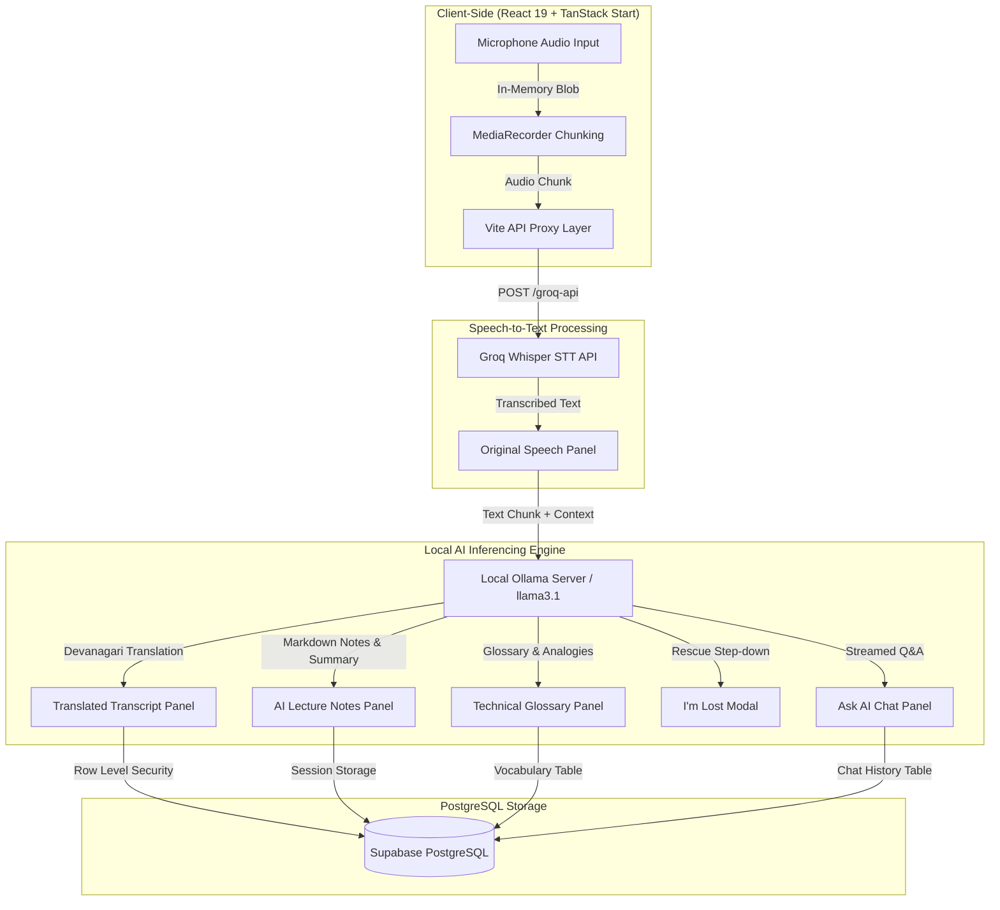

# EduBridge AI — AI-Powered Classroom Companion

[](https://react.dev/)
[](https://tanstack.com/)
[](https://www.typescriptlang.org/)
[](https://tailwindcss.com/)
[](https://supabase.com/)
[](https://ollama.com/)
[](https://groq.com/)

> **EduBridge AI** is an anonymous, privacy-first, real-time AI classroom companion designed to bridge comprehension gaps for students during lectures. It captures spoken lecture audio in-memory, provides live side-by-side bilingual translation, auto-generates structured lecture notes, extracts technical glossaries, provides an instant **"I'm Lost"** step-down rescue modal, and offers streamed Q&A grounded in live lecture context — powered by **local Llama 3.1 AI** and **Groq Whisper STT**.

---

## 🌟 Key Features

| Feature | Description |
|---|---|
| 🎙️ **Live Dual-Transcript** | Streams spoken classroom audio directly from browser mic into original transcript chunks using **Groq Whisper STT**. |
| 🌐 **Real-time Multilingual Translation** | Translates lecture speech live into **Devanagari Hindi**, French, Gujarati, and English side-by-side. |
| 📝 **Auto-Generated AI Notes** | Extracts structured markdown notes, key takeaways, running lecture summaries, and keywords as the teacher speaks. |
| 📚 **Contextual Technical Glossary** | Automatically identifies complex technical terms and creates formal definitions + real-world analogies. |
| 🆘 **"I'm Lost" Step-down Rescue** | Instant rescue button that simplifies the recent 5-minute lecture segment with real-life analogies for confused students. |
| 💬 **Lecture-Grounded Ask AI** | Streamed interactive Q&A chat where students can ask questions answered strictly using the active lecture context. |
| 🔒 **Privacy-First Architecture** | Zero raw audio stored in database or storage. Audio is processed in-memory only and immediately garbage-collected. |
| 🏠 **Hybrid Local AI (0 API Cost)** | Connects natively to local **Ollama (Llama 3.1)** on `http://localhost:11434` for zero-cost offline AI inferencing. |

---

## 📐 System Architecture



---

## 🖼️ Feature Walkthrough & Interface

### 1. Live Dual Transcript & Real-Time Devanagari Translation
> *Simultaneously displays raw speech-to-text on the left and live translated Devanagari Hindi on the right as the teacher speaks.*

```
+-----------------------------------------------------------------------------------+
|  Original Speech (Groq Whisper STT)     |  Translated Transcript (Hindi Devanagari) |
|  -----------------------------------    |  --------------------------------------- |
|  Chunk #1: "Welcome to Machine Learning" |  Chunk #1: "मशीन लर्निंग में स्वागत है"   |
|  Chunk #2: "Today we study neural nets" |  Chunk #2: "आज हम न्यूरल नेटवर्क का..."   |
+-----------------------------------------------------------------------------------+
```

### 2. Auto-Generated Structured Notes & Running Summary
> *Organizes continuous spoken audio into readable markdown bullet points, main concepts, and running context summaries.*

```
+-----------------------------------------------------------------------------------+
| 📝 AI Lecture Notes                                                               |
| • What is Machine Learning? Systems learning patterns from data.                 |
| • Neural Networks: Interconnected layers applying weighted sums and activation.   |
| • Overfitting: Model memorizing noise instead of generalizing.                    |
+-----------------------------------------------------------------------------------+
```

### 3. "I'm Lost" Viewport-Centered Rescue Modal
> *When a student gets overwhelmed by complex terminology, clicking "I'm Lost" opens a viewport-centered rescue breakdown with simple language and analogies.*

```
+-----------------------------------------------------------------------------------+
|                        🆘 RESCUE EXPLANATION (STEP-DOWN)                          |
|                                                                                   |
|  Simpler Terms: Neural networks pass signals through layers to learn patterns.    |
|  Real-Life Analogy: Think of it like a chain of relay stations passing messages.  |
|                                                                                   |
|  [ Got It! Back to Class ]                                                        |
+-----------------------------------------------------------------------------------+
```

### 4. Interactive Ask AI Chat Panel
> *Streams instant answers to student questions, strictly constrained to the current lecture's context, notes, and glossary terms.*

---

## 🛠️ Technology Stack

| Layer | Technologies |
|---|---|
| **Frontend Framework** | React 19, TanStack Start (SSR), Vite 8 |
| **Styling & UI** | Tailwind CSS v4, Glassmorphism, Lucide Icons |
| **State & Persistence** | React Hooks, `@supabase/supabase-js` |
| **Speech Recognition** | Groq Whisper Large v3 Turbo (`https://api.groq.com`) |
| **Local LLM Engine** | Ollama (`llama3.1` model on `http://localhost:11434`) |
| **Database & Security** | Supabase PostgreSQL 15, Row Level Security (RLS) |

---

## 🚀 Quick Start & Installation

### 1. Prerequisites
- **Node.js** v18+ & **Bun** or **npm**
- **Ollama** installed on your system ([Download Ollama](https://ollama.com/download))

### 2. Clone & Install Dependencies
```sh
git clone https://github.com/aditipriyadubey/TETRA025.git
cd TETRA025
npm install
```

### 3. Environment Setup (`.env.local`)
Create a `.env.local` file in the root directory:

```env
# ── Supabase (Client-Side) ───────────────────────────────────
VITE_SUPABASE_URL=https://xzjmaibsrhgplbkyqloh.supabase.co
VITE_SUPABASE_ANON_KEY=your_supabase_anon_key

# ── Server / Edge Secrets ─────────────────────────────────────
SUPABASE_SERVICE_ROLE_KEY=your_supabase_service_role_key
GROQ_API_KEY=gsk_your_groq_api_key
GEMINI_API_KEY=your_gemini_api_key
AI_INFERENCE_API_HOST=http://host.docker.internal:11434
```

### 4. Pull Local Llama 3.1 Model
Open your terminal and run:
```sh
ollama pull llama3.1
```

### 5. Run the Application
```sh
npm run dev
```

Open `http://localhost:5173/try` (or `5174`) in your browser to launch the application!

---

## 📊 Database Schema Overview

The database is built on Supabase PostgreSQL with **Row Level Security (RLS)** and **zero mandatory user login** (session-based):

```
┌─────────────────┐       ┌─────────────────┐       ┌─────────────────┐
│    sessions     │──────<│   transcripts   │      <│      notes      │
├─────────────────┤       ├─────────────────┤       ├─────────────────┤
│ session_id (PK) │       │ id (PK)         │       │ session_id (PK) │
│ mode            │       │ session_id (FK) │       │ content_markdown│
│ language        │       │ chunk_index     │       └─────────────────┘
└─────────────────┘       │ text            │
        │                 │ translated_text │       ┌─────────────────┐
        │                 └─────────────────┘      <│   vocabulary    │
        │                                           ├─────────────────┤
        │                 ┌─────────────────┐       │ id (PK)         │
        └────────────────<│  chat_history   │       │ session_id (FK) │
                          ├─────────────────┤       │ term            │
                          │ id (PK)         │       │ definition      │
                          │ session_id (FK) │       │ analogy         │
                          │ role            │       │ translation     │
                          │ content         │       └─────────────────┘
                          └─────────────────┘
```

---

## 🔒 Security & Privacy Commitments

- **No Raw Audio Storage:** Raw audio recorded from the browser mic is held purely in RAM for STT processing and is immediately discarded.
- **Anonymous Sessions:** No student PII (Personally Identifiable Information) or forced OAuth authentication is required to use the platform.
- **Secret Isolation:** `GROQ_API_KEY`, `GEMINI_API_KEY`, and `SUPABASE_SERVICE_ROLE_KEY` are isolated and never exposed in client bundles.

---

## 📜 License

Distributed under the MIT License. See `LICENSE` for more information.
