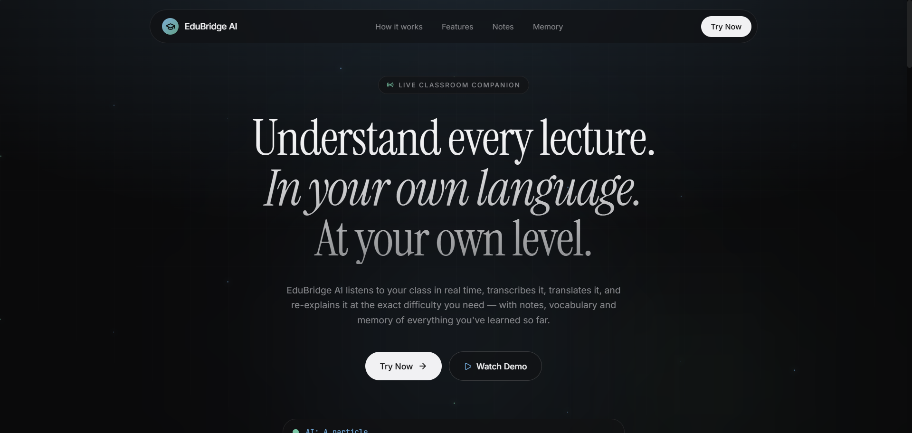
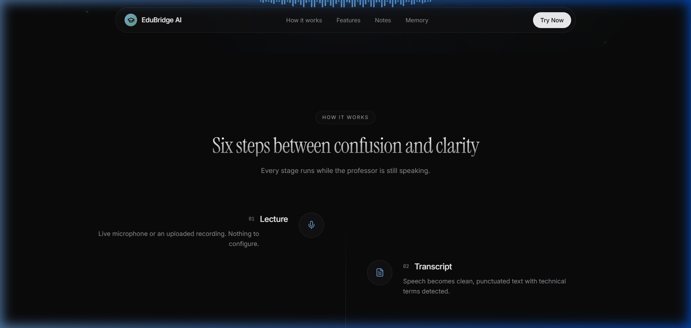
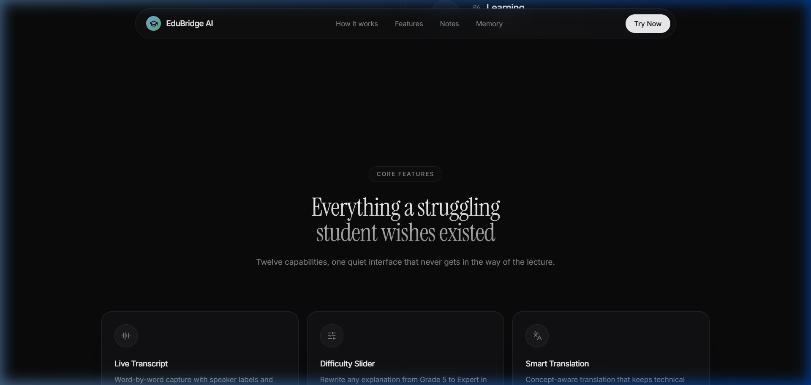
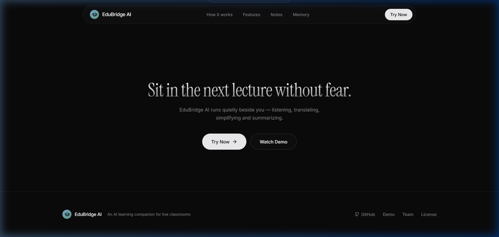
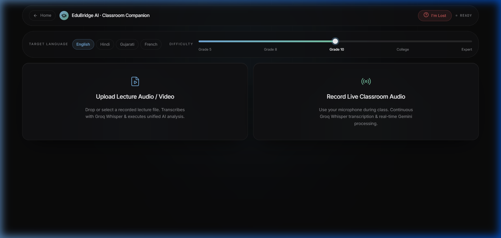
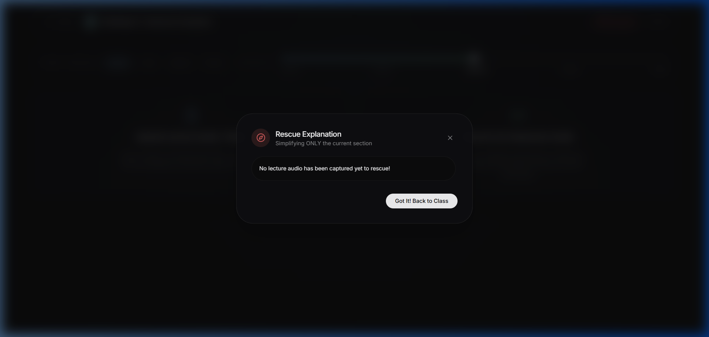
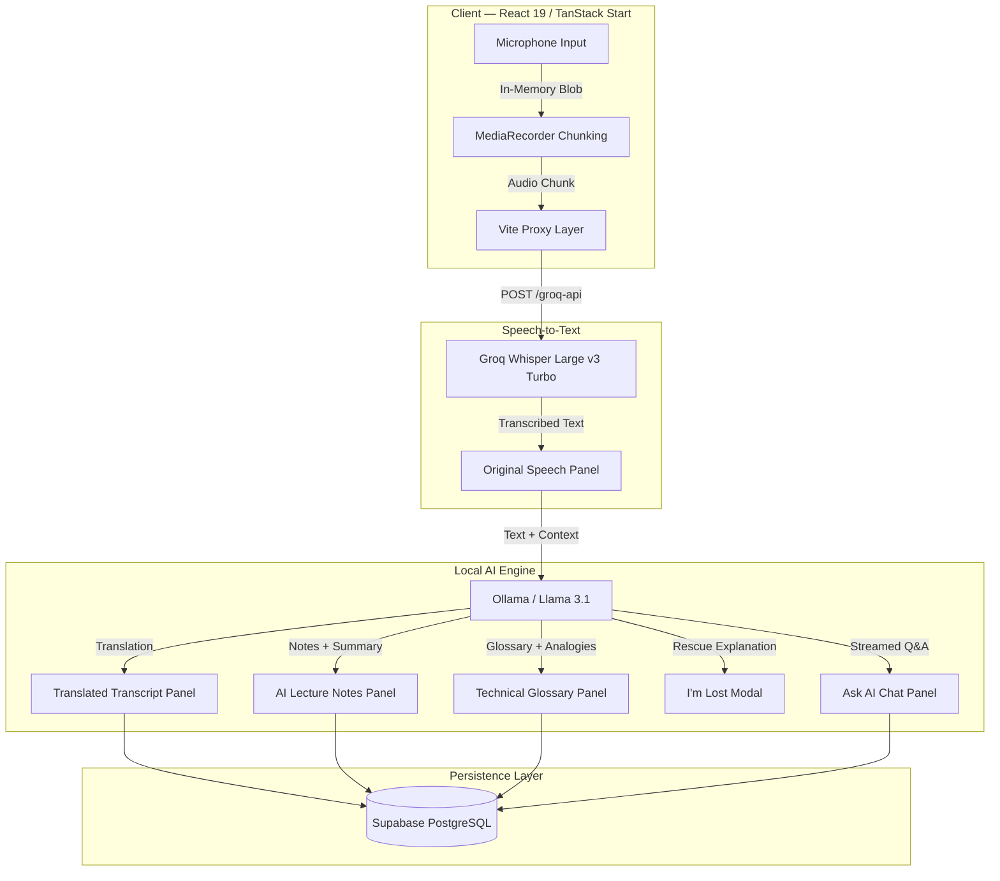
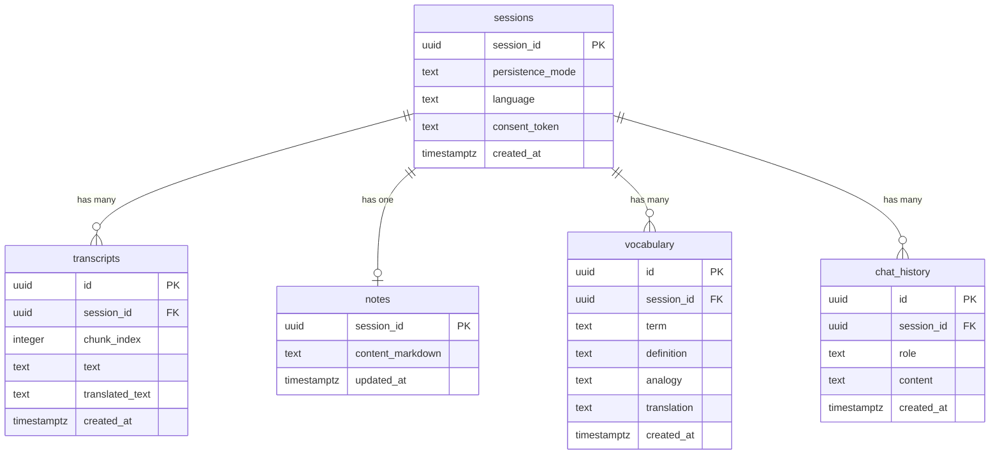

# EduBridge AI

### AI-Powered Real-Time Classroom Companion

[](https://react.dev/)
[](https://tanstack.com/)
[](https://www.typescriptlang.org/)
[](https://tailwindcss.com/)
[](https://supabase.com/)
[](https://ollama.com/)
[](https://groq.com/)

---

## Overview

EduBridge AI is an anonymous, privacy-first, real-time AI classroom companion designed to bridge comprehension gaps for students during lectures. It captures spoken lecture audio in-memory, provides live side-by-side bilingual translation, auto-generates structured lecture notes, extracts technical glossaries, provides an instant "I'm Lost" step-down rescue modal, and offers streamed Q&A grounded in live lecture context.

All AI inferencing is powered by a **local Llama 3.1 model** running through Ollama, with speech recognition handled by **Groq Whisper Large v3 Turbo**. No raw audio is ever stored — processing happens entirely in-memory and is discarded immediately after transcription.

---

## Table of Contents

1. [Screenshots and Interface Tour](#screenshots-and-interface-tour)
2. [Core Features](#core-features)
3. [System Architecture](#system-architecture)
4. [Data Flow Pipeline](#data-flow-pipeline)
5. [Technology Stack](#technology-stack)
6. [Database Schema](#database-schema)
7. [Installation and Setup](#installation-and-setup)
8. [Environment Configuration](#environment-configuration)
9. [Security and Privacy](#security-and-privacy)
10. [License](#license)

---

## Screenshots and Interface Tour

### Landing Page

The landing page introduces EduBridge AI with a dark glassmorphic interface. It presents the product value proposition, outlines the six-step process from confusion to clarity, and showcases all twelve platform capabilities.


*Figure 1: Landing page hero section — "Understand every lecture. In your own language. At your own level."*

<br>


*Figure 2: Six-step process flow — from microphone input to structured lecture comprehension.*

<br>


*Figure 3: Feature capabilities grid — live transcription, translation, glossary extraction, and more.*

<br>


*Figure 4: Footer section with final call-to-action and technology credits.*

---

### Classroom Companion Dashboard

The classroom dashboard is the primary interface where students interact with live lectures. It includes language selection (English, Hindi, Gujarati, French), difficulty calibration (Grade 5 through Expert), and mode selection for live recording or file upload.


*Figure 5: Classroom companion dashboard — language selector, difficulty slider, and input mode selection.*

---

### "I'm Lost" Rescue Modal

When a student feels overwhelmed during a lecture, the "I'm Lost" button triggers a viewport-centered modal that fetches a step-down explanation from the local Llama 3.1 model, using only the recent lecture transcript as context.


*Figure 6: "I'm Lost" rescue modal — viewport-centered overlay with simplified explanation.*

---

## Core Features

### Live Dual-Transcript Display

Streams spoken classroom audio directly from the browser microphone. Audio chunks are transcribed in real time using Groq Whisper STT, producing an original-language transcript on the left panel and a translated transcript on the right. Supported target languages include Hindi (Devanagari script), Gujarati, French, and English.

### Auto-Generated Structured Notes

Each transcribed chunk is processed through the local Llama 3.1 model to extract structured markdown bullet-point notes, main concepts, and a continuously updated running summary. Notes accumulate across chunks without resetting.

### Contextual Technical Glossary

The AI automatically identifies complex technical terms from the lecture transcript and generates formal definitions alongside simple real-world analogies. Terms are deduplicated across chunks and stored in the vocabulary table.

### "I'm Lost" Step-Down Rescue

A single-click rescue button that takes the last five transcript chunks and generates a simplified explanation with real-life analogies. The modal renders via React Portal directly onto `document.body` at z-index 9999, ensuring it is always centered regardless of scroll position.

### Lecture-Grounded Ask AI Chat

An interactive Q&A panel where students can ask questions about the current lecture. Responses are streamed in real time and are strictly grounded in the active lecture context — including the running summary, recent transcript, notes, glossary, and keywords.

### Privacy-First Architecture

Zero raw audio is stored in the database or any persistent storage. Audio blobs are held in browser RAM for the duration of STT processing and are immediately garbage-collected. Sessions are anonymous — no student PII or OAuth authentication is required.

### Hybrid Local AI (Zero API Cost)

All AI processing connects natively to a local Ollama instance running Llama 3.1 on `http://localhost:11434`. Vite dev proxies (`/ollama-api` and `/groq-api`) eliminate CORS restrictions entirely, allowing direct browser-to-model communication during development.

---

## System Architecture



---

## Data Flow Pipeline

The processing pipeline executes the following sequence for each audio chunk captured from the browser microphone:

```
1. Browser MediaRecorder captures 5-second audio chunk (WebM blob)
2. Chunk is sent to Groq Whisper via /groq-api Vite proxy
3. Whisper returns transcribed text (silent/noise chunks are filtered)
4. Transcribed text is appended to the original transcript panel
5. Text is sent to local Ollama (Llama 3.1) via /ollama-api proxy with:
   - Target language
   - Current difficulty level
   - Running summary context
   - Existing notes context
6. Ollama returns structured JSON:
   - translated_text (Devanagari Hindi, French, etc.)
   - notes (markdown bullet points)
   - summary (updated running summary)
   - glossary (term + definition + analogy)
   - keywords (extracted terms)
7. Frontend state is updated (accumulative, never reset)
8. Data is persisted to Supabase PostgreSQL via RLS-protected client
```

---

## Technology Stack

| Layer | Technology | Purpose |
|---|---|---|
| Frontend Framework | React 19, TanStack Start | Server-side rendering, routing, hydration |
| Build Tool | Vite 8 | Dev server, HMR, proxy configuration |
| Styling | Tailwind CSS v4 | Utility-first CSS with glassmorphism design tokens |
| Icons | Lucide React | Consistent icon system |
| Language | TypeScript 5 | Type safety across frontend and Edge Functions |
| Speech Recognition | Groq Whisper Large v3 Turbo | Real-time audio-to-text transcription |
| Local LLM | Ollama (Llama 3.1) | Translation, notes, glossary, rescue, Q&A |
| Database | Supabase PostgreSQL 15 | Session, transcript, notes, vocabulary, chat storage |
| Security | Row Level Security (RLS) | Database-level access control |
| Edge Functions | Supabase Deno Functions | Server-side API endpoints |

---

## Database Schema

The application uses five tables in Supabase PostgreSQL, all protected by Row Level Security:

```
sessions
├── session_id (PK, UUID)
├── persistence_mode (text)
├── language (text)
├── consent_token (text)
└── created_at (timestamptz)

transcripts
├── id (PK, UUID)
├── session_id (FK → sessions)
├── chunk_index (integer)
├── text (text)
├── translated_text (text)
└── created_at (timestamptz)

notes
├── session_id (PK, FK → sessions)
├── content_markdown (text)
└── updated_at (timestamptz)

vocabulary
├── id (PK, UUID)
├── session_id (FK → sessions)
├── term (text)
├── definition (text)
├── analogy (text)
├── translation (text)
└── created_at (timestamptz)

chat_history
├── id (PK, UUID)
├── session_id (FK → sessions)
├── role (text: 'user' | 'assistant')
├── content (text)
└── created_at (timestamptz)
```

### Entity Relationship Diagram



---

## Installation and Setup

### Prerequisites

- Node.js v18 or later
- npm or Bun package manager
- Ollama installed on the local machine ([download](https://ollama.com/download))
- A Supabase project with PostgreSQL enabled
- A Groq API key for Whisper STT access

### Step 1: Clone the Repository

```sh
git clone https://github.com/aditipriyadubey/TETRA025.git
cd TETRA025
```

### Step 2: Install Dependencies

```sh
npm install
```

### Step 3: Pull the Local AI Model

```sh
ollama pull llama3.1
```

### Step 4: Configure Environment Variables

Create a `.env.local` file in the project root. See the [Environment Configuration](#environment-configuration) section below for required variables.

### Step 5: Apply Database Migrations

Open the Supabase SQL Editor for your project and run the migration file located at:

```
supabase/migrations/20260801065340_initial_schema.sql
```

### Step 6: Start the Development Server

```sh
ollama serve          # Terminal 1: Start local AI server
npm run dev           # Terminal 2: Start Vite dev server
```

The application will be available at `http://localhost:5173/try`.

---

## Environment Configuration

Create a `.env.local` file in the project root with the following variables:

```env
# Supabase (Client-Side — exposed to browser via VITE_ prefix)
VITE_SUPABASE_URL=https://your-project-ref.supabase.co
VITE_SUPABASE_ANON_KEY=your-anon-key

# Supabase (Server-Side — Edge Functions only, never in client bundle)
SUPABASE_SERVICE_ROLE_KEY=your-service-role-key

# Groq Whisper STT
GROQ_API_KEY=gsk_your-groq-api-key

# Gemini (optional, for Edge Function fallback)
GEMINI_API_KEY=your-gemini-api-key

# Local Ollama Host (used by Edge Functions when running via Docker)
AI_INFERENCE_API_HOST=http://host.docker.internal:11434
```

**Important:** The `GROQ_API_KEY` is exposed to the browser via the `envPrefix` configuration in `vite.config.ts`. This is acceptable for development but should be proxied through a server-side endpoint in production.

---

## Security and Privacy

| Concern | Implementation |
|---|---|
| Raw Audio Storage | None. Audio blobs are held in browser RAM only and garbage-collected after STT processing. |
| Student Identity | Anonymous. No PII collection, no OAuth, no mandatory login. Sessions are UUID-based. |
| API Key Isolation | `SUPABASE_SERVICE_ROLE_KEY` is never exposed to the client. Only `VITE_`-prefixed keys reach the browser. |
| Database Access | All tables are protected by Supabase Row Level Security (RLS). |
| Consent | An ethical consent dialog is presented before any audio recording begins. |

---

## Project Structure

```
TETRA025/
├── src/
│   ├── components/
│   │   ├── demo/              # Demo page components (landing)
│   │   └── session/           # Live session components
│   │       ├── TranscriptDual.tsx
│   │       ├── ImLostButton.tsx
│   │       ├── NotesPanel.tsx
│   │       ├── GlossaryPanel.tsx
│   │       ├── ChatPanel.tsx
│   │       └── TTSButton.tsx
│   ├── lib/
│   │   ├── api.ts             # API wrappers (Groq + Ollama fallbacks)
│   │   ├── db.ts              # Supabase persistence layer
│   │   ├── supabaseClient.ts  # Supabase client singleton
│   │   └── useSessionBackend.ts  # Session state management hook
│   └── routes/
│       ├── index.tsx           # Landing page
│       └── try.tsx             # Classroom companion page
├── supabase/
│   ├── functions/
│   │   ├── _shared/ollama.ts  # Shared Ollama helper
│   │   ├── stt-proxy/         # Speech-to-text Edge Function
│   │   ├── process/           # Unified AI processing Edge Function
│   │   ├── ask/               # Ask AI streaming Edge Function
│   │   └── im-lost/           # Rescue explanation Edge Function
│   └── migrations/            # PostgreSQL schema migrations
├── docs/
│   └── screenshots/           # Application screenshots
├── vite.config.ts             # Vite config with Ollama/Groq proxies
├── .env.local                 # Environment variables (gitignored)
└── README.md                  # This file
```

---

## License

Distributed under the MIT License. See `LICENSE` for more information.

---

*Built with precision for the TETRA025 hackathon. EduBridge AI — bridging the gap between confusion and clarity.*
